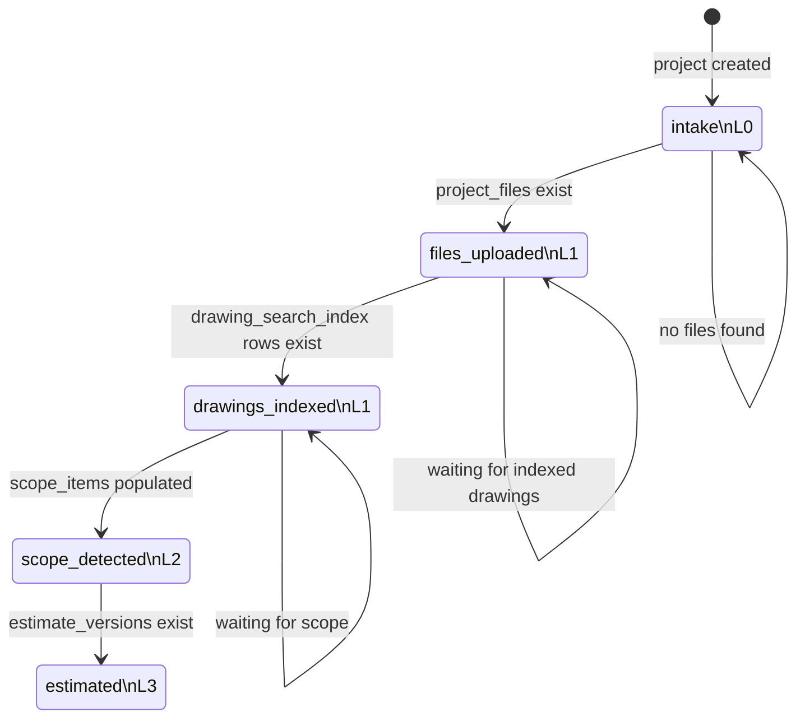

# System Workflow

This document captures the main application workflow for the Rebar Estimator app, from project intake through estimation, review, quoting, and CRM sync.

The diagrams below are based on the current implementation in:

- `src/pages/Dashboard.tsx`
- `src/components/chat/ChatArea.tsx`
- `src/components/chat/ApprovalWorkflow.tsx`
- `src/components/dashboard/QuoteWorkflow.tsx`
- `src/pages/ReviewPage.tsx`
- `supabase/functions/process-pipeline/index.ts`
- `supabase/functions/push-quote-to-crm/index.ts`

## End-to-end system flow

```mermaid
flowchart TB
    user["Estimator / Project Owner"]

    subgraph ui["React application"]
        dashboard["Dashboard"]
        chat["ChatArea"]
        approval["ApprovalWorkflow"]
        quotes["QuoteWorkflow"]
        review["ReviewPage"]
    end

    subgraph edge["Supabase edge functions"]
        pipeline["process-pipeline"]
        scope["resolve-scope"]
        crm["push-quote-to-crm"]
    end

    subgraph data["Supabase tables"]
        projects[("projects")]
        files[("project_files")]
        drawings[("drawing_search_index")]
        jobs[("processing_jobs")]
        estimates[("estimate_versions")]
        quote_versions[("quote_versions")]
        review_shares[("review_shares")]
        review_comments[("review_comments")]
        deals[("crm_deals")]
        audit[("audit_log")]
    end

    user --> dashboard
    dashboard -->|"create project"| projects
    dashboard -->|"upload source files"| files
    dashboard -->|"invoke pipeline"| pipeline

    pipeline -->|"read uploaded files"| files
    pipeline -->|"read indexed drawing count"| drawings
    pipeline -->|"read estimate count"| estimates
    pipeline -->|"update linkage_score + workflow_status"| projects
    pipeline -->|"publish progress"| jobs
    pipeline -->|"record pipeline events"| audit

    dashboard -. "realtime progress subscription" .-> jobs

    chat -->|"persist estimate snapshot"| estimates
    chat -->|"set project to estimated"| projects
    chat -->|"record estimate_created"| audit
    chat -->|"resolve scope evidence"| scope

    quotes -->|"create / issue quote"| quote_versions
    quotes -->|"share for review"| review_shares
    quotes -->|"push quote to CRM"| crm

    approval -->|"open share dialog / track review status"| review_shares
    review -->|"load public share"| review_shares
    review -->|"save reviewer feedback"| review_comments
    review -->|"mark share viewed/commented"| review_shares

    crm -->|"update local or Odoo-backed deal"| deals
```

## Persisted project pipeline states

`process-pipeline` is the main source of truth for project readiness. It computes both a `workflow_status` and a `linkage_score` based on what data is already present for a project.

## What each stage means

| Stage | Score | Trigger in current code |
| --- | --- | --- |
| `intake` | `L0` | Project exists, but the pipeline found no uploaded files |
| `files_uploaded` | `L1` | `project_files` rows exist for the project |
| `drawings_indexed` | `L1` | Searchable drawing rows exist in `drawing_search_index` |
| `scope_detected` | `L2` | `projects.scope_items` is populated and drawings are indexed |
| `estimated` | `L3` | At least one `estimate_versions` row exists and prior prerequisites are satisfied |

## Human review and quote path

The quoting flow sits on top of the pipeline states:

1. `ChatArea` persists an estimate snapshot to `estimate_versions`.
2. `ApprovalWorkflow` advances the review chain:
   - `estimation_ready`
   - `sent_to_ben`
   - `ben_approved`
   - `sent_to_neel`
   - `neel_approved`
   - `sent_to_customer`
3. `QuoteWorkflow` creates `quote_versions`, optionally issues them, and can generate a public review link through `review_shares`.
4. `ReviewPage` lets external reviewers leave `review_comments`, which updates the share status from `pending` to `viewed` or `commented`.
5. `push-quote-to-crm` syncs the selected quote into `crm_deals` and, when configured, an Odoo CRM record.
